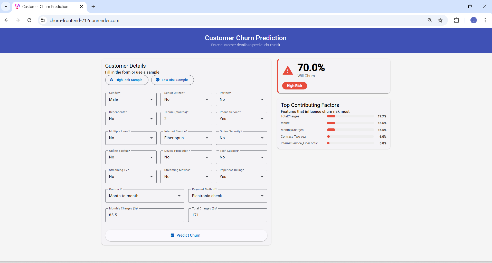

# Customer Churn Prediction

A full-stack ML web app that predicts whether a telecom customer will churn.

**Live demo:** https://churn-frontend-712r.onrender.com



**API docs:** https://churn-api-wgoc.onrender.com/docs

---

## What it does
User enters customer details → app returns churn probability, risk level
and top 5 contributing features.

---

## Tech stack
| Layer | Technology |
|---|---|
| Machine learning | Python, scikit-learn (Random Forest) |
| Backend API | FastAPI |
| Frontend | Angular 19 + Angular Material |
| Containerisation | Docker |
| Deployment | Render |

---

## Model performance
| Metric | Score |
|---|---|
| Accuracy | 79.6% |
| F1 Score | 56.9% |
| ROC-AUC | 82.7% |

---

## Run with Docker (recommended)
```bash
git clone https://github.com/LIYANAFAISEL/churn-prediction.git
cd churn-prediction
docker compose up
```
Open `http://localhost`

---

## Run locally
```bash
# API
python -m venv venv
venv\Scripts\activate
cd api
python -m uvicorn main:app --port 8000

# Frontend (new terminal)
cd frontend
npm install
ng serve
```
Open `http://localhost:4200`

---

## Key findings
- Month-to-month customers churn at 42.7% vs 2.8% for two-year contracts
- 47.7% of all churns happen within the first 12 months
- Fiber optic customers churn at 41.9% vs 19.0% for DSL

---

## Status
- [x] Phase 1: Data exploration and EDA
- [x] Phase 2: Preprocessing, model training and feature importance
- [x] Phase 3: FastAPI backend
- [x] Phase 4: Angular frontend
- [x] Phase 5: Docker + deployment

---

## Dataset
[Telco Customer Churn — Kaggle](https://www.kaggle.com/datasets/blastchar/telco-customer-churn)